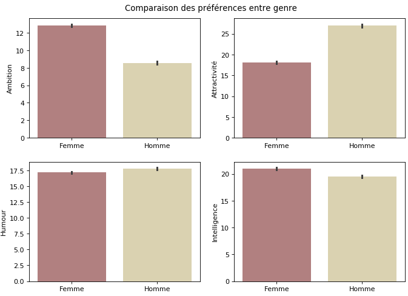
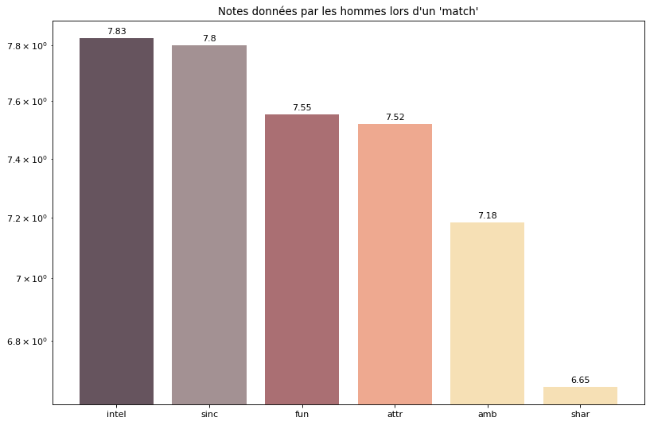
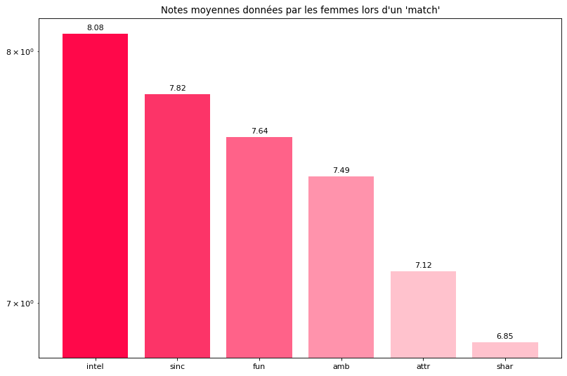

# Speed dating: visualization project

## Jedha Data Science Bootcamp - Fullstack - Semaine 2

_Session dsmft-paris-08_

A partir du dataset [Speed dating data](https://www.kaggle.com/annavictoria/speed-dating-experiment/) de Kaggle, effectuer une visualisation et faire une analyse descriptive des principaux facteurs qui influencent le fait d'obtenir un deuxième rendez-vous.

Ce dataset a été constitué lors d'une étude menée par la [Columbia Business School](http://faculty.chicagobooth.edu/emir.kamenica/documents/genderDifferences.pdf).
Cette étude consistait en l'observation de speed dating expérimentaux; les participants devaient s'inscrire, répondre à des questionnaires quand à leurs attentes.
Lors des évènements, après un entretien de 4 minutes, ils devaient noter le partenaire et décider s'il voulait le revoir.

Les critères notés:
* Attractiveness
* Sincerity
* Intelligence
* Fun
* Ambition
* Shared Interests

La visualisation montre que les attentes sont différentes selon les genres:

Les **traits de caractères** les plus _**clivants**_ entre genres: 
- _chez la femme_ : **Ambition**, Sincérité, Appartenance ethnique, Convictions religieuses
- _chez l'homme_ : **Attractivité**

Si l'attractivité semblait être importante à priori pour les hommes,
quand il s'est agit de décider d'un autre rendez-vous **l'intelligence** et **la sincérité** 
étaient aussi bien noté chez les hommes:

que chez les femmes:

